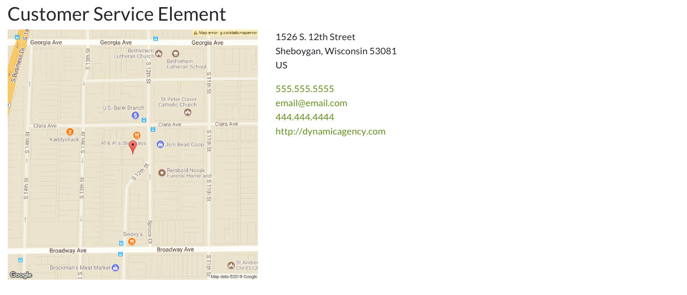
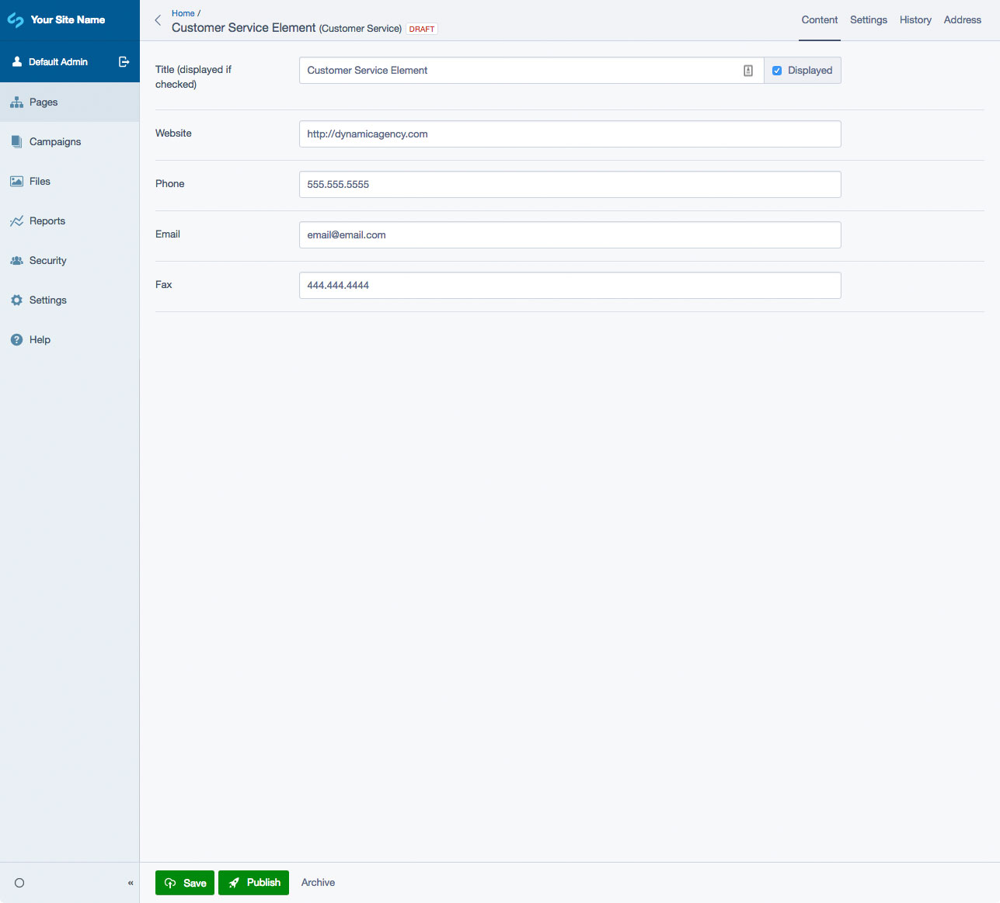
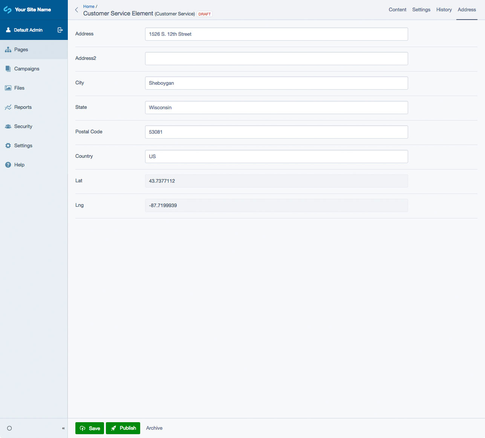

# SilverStripe Elemental Customer Service Block

Display a map, directions, and contact info for your location.

[](https://travis-ci.org/dynamic/silverstripe-elemental-customer-service)
[](https://scrutinizer-ci.com/g/dynamic/silverstripe-elemental-customer-service/?branch=master)
[](https://scrutinizer-ci.com/g/dynamic/silverstripe-elemental-customer-service/?branch=master)
[](https://scrutinizer-ci.com/g/dynamic/silverstripe-elemental-customer-service/build-status/master)
[](https://codecov.io/gh/dynamic/silverstripe-elemental-customer-service)

[](https://packagist.org/packages/dynamic/silverstripe-elemental-customer-service)
[](https://packagist.org/packages/dynamic/silverstripe-elemental-customer-service)
[](https://packagist.org/packages/dynamic/silverstripe-elemental-customer-service)
[](https://packagist.org/packages/dynamic/silverstripe-elemental-customer-service)


## Requirements

* silverstripe/recipe-cms: ^1@dev || ^4@dev
* dnadesign/silverstripe-elemental: ^2@dev || ^3@dev
* dynamic/silverstripe-geocoder: ^1@dev

## Installation

`composer require dynamic/silverstripe-elemental-customer-service`

## Usage

Adds a Customer Service block to display a map, directions and contact info for your location. Userful for a Contact Us page.

### Note
In order to use the Geocoder and address map, you will have to create an [API key](https://developers.google.com/maps/documentation/javascript/get-api-key). It can be configured in your YML file like this:

```
Dynamic\SilverStripeGeocoder\GoogleGeocoder:
  geocoder_api_key: 'your-key-here'
```  

## Screen Shots

#### Front End sample of a Customer Service Element


#### CMS - Customer Service Element Main Tab


#### CMS - Customer Service Element - Address Tab


## Getting more elements

See [Elemental modules by Dynamic](https://github.com/dynamic/silverstripe-elemental-blocks#included-blocks)

## Configuration

See [SilverStripe Elemental Configuration](https://github.com/dnadesign/silverstripe-elemental#configuration)
