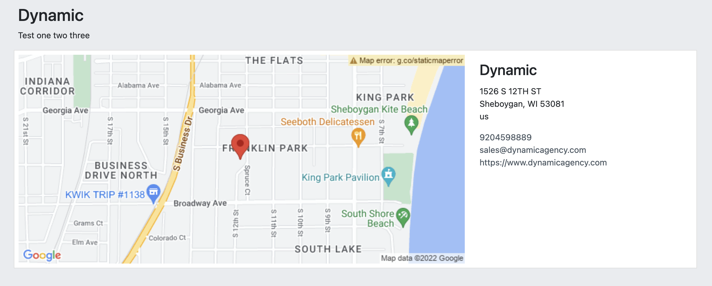
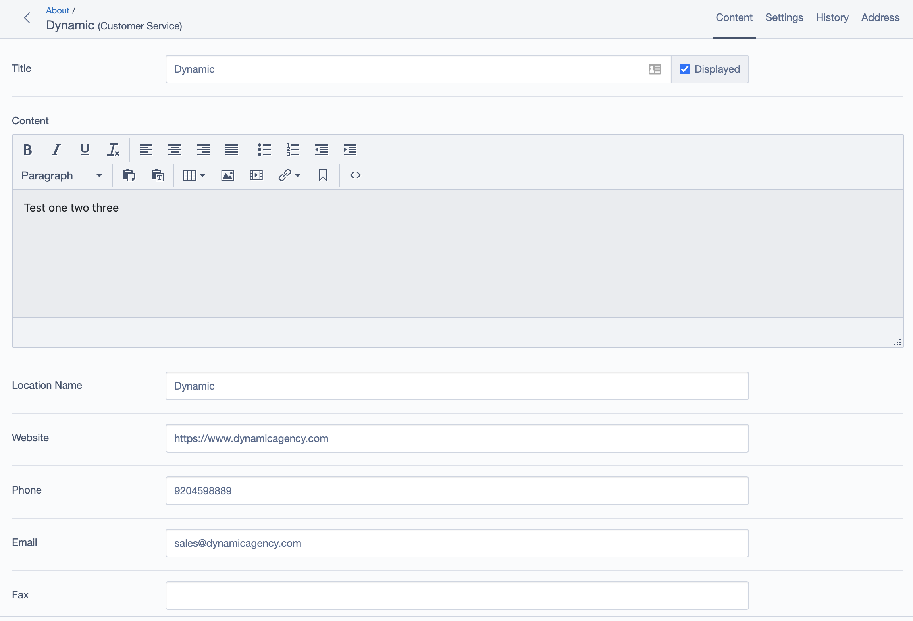
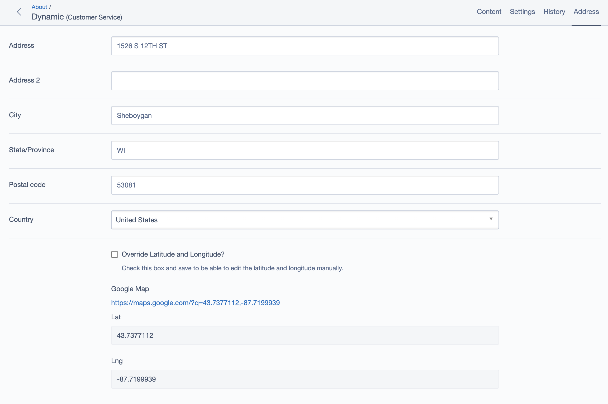

# SilverStripe Elemental Customer Service Block

Display a map, directions, and contact info for your location.

[](https://github.com/dynamic/silverstripe-elemental-customer-service/actions/workflows/ci.yml)
[](https://github.com/sponsors/dynamic)

[](https://packagist.org/packages/dynamic/silverstripe-elemental-customer-service)
[](https://packagist.org/packages/dynamic/silverstripe-elemental-customer-service)
[](https://packagist.org/packages/dynamic/silverstripe-elemental-customer-service)
[](https://packagist.org/packages/dynamic/silverstripe-elemental-customer-service)


## Requirements

* dnadesign/silverstripe-elemental: ^4.8
* dynamic/silverstripe-geocoder: ^2.0

## Installation

`composer require dynamic/silverstripe-elemental-customer-service`

## Usage

Adds a Customer Service block to display a map, directions and contact info for your location. Userful for a Contact Us page.

### Note
In order to use the Geocoder and address map, you will need to set two [Google API keys](https://developers.google.com/maps/documentation/javascript/get-api-key). Each key needs to have specific API libraries enabled:
* `geocoder_api_key`
    * Geocoding API
* `map_api_key`
    * Maps JavaScript API
    *  Maps Static API

They can be set in your YML file like this:

```
Dynamic\SilverStripeGeocoder\GoogleGeocoder:
  geocoder_api_key: 'your-key-here'
  map_api_key: 'your-key-here'
```

For more, see [Silverstripe Geocoder](https://github.com/dynamic/silverstripe-geocoder#google-api-keys)

## Screen Shots

#### Front End sample of a Customer Service Element


#### CMS - Customer Service Element Main Tab


#### CMS - Customer Service Element - Address Tab


## Getting more elements

See [Elemental modules by Dynamic](https://github.com/orgs/dynamic/repositories?q=elemental&type=all&language=&sort=)

## Configuration

See [SilverStripe Elemental Configuration](https://github.com/dnadesign/silverstripe-elemental#configuration)

## Maintainers

*  [Dynamic](http://www.dynamicagency.com) (<dev@dynamicagency.com>)

## Bugtracker
Bugs are tracked in the issues section of this repository. Before submitting an issue please read over
existing issues to ensure yours is unique.

If the issue does look like a new bug:

- Create a new issue
- Describe the steps required to reproduce your issue, and the expected outcome. Unit tests, screenshots
  and screencasts can help here.
- Describe your environment as detailed as possible: SilverStripe version, Browser, PHP version,
  Operating System, any installed SilverStripe modules.

Please report security issues to the module maintainers directly. Please don't file security issues in the bugtracker.

## Development and contribution
If you would like to make contributions to the module please ensure you raise a pull request and discuss with the module maintainers.
